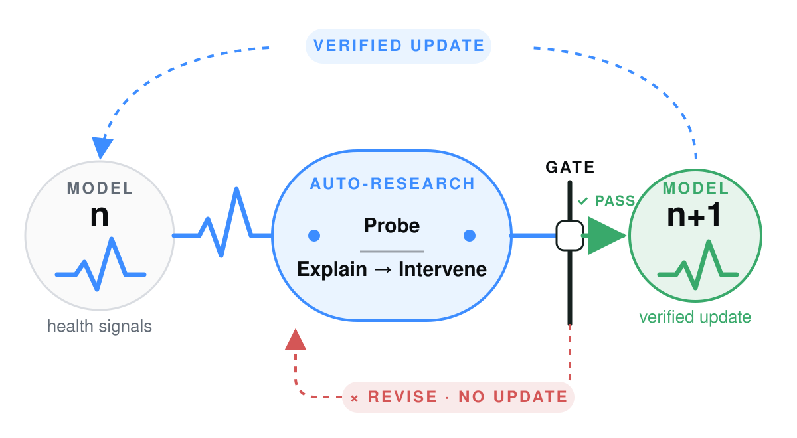
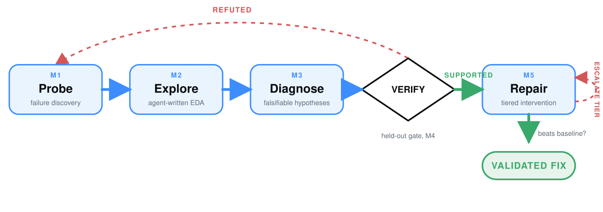

<div align="center">

# EvalRX

### A self-improving loop that repairs open-weight models — and verifies every fix.

<picture>
  <source media="(prefers-color-scheme: dark)" srcset="docs/assets/figures/model-health-teaser-dark.svg">
  
</picture>

[](https://pypi.org/project/evalrx/)
[](https://pypi.org/project/evalrx/)
[](https://github.com/evalvitals/evalrx/actions/workflows/ci.yml)
[](https://evalvitals.github.io/evalrx/overview/)
[](https://evalvitals.github.io/evalrx/demo/)
[](LICENSE)

[Loop](#the-loop) · [Ladder](#the-repair-ladder) · [Trust](#why-the-loop-is-trustworthy) · [Quickstart](#quickstart) · [Docs](https://evalvitals.github.io/evalrx/overview/) · [Demo](https://evalvitals.github.io/evalrx/demo/) · [GitHub](https://github.com/evalvitals/evalrx)

<br>

[](https://evalvitals.github.io/evalrx/demo/)

<sub>One real run, replayed — 256 MMAU cases, 162 failures, two of three
mechanisms upheld on cases the analysis never saw, and an L2 repair that fixed
25 of them while breaking none. 20 minutes of work compressed into 22 seconds;
the clock in the gutter is the run's own elapsed time.
[Browse two full reports →](https://evalvitals.github.io/evalrx/demo/)</sub>

</div>

An eval score is a temperature reading. EvalRX runs the lab: probe a model for
failures, form a mechanism, test it on cases the analysis never saw, then
climb a repair ladder until a fix beats the unmodified baseline. Only a
held-out win updates the model — the healthier model becomes the next subject.

## The loop

Five stages, no hand-off between them: one agent writes and runs its own
analysis code, proposes hypotheses, generates repair candidates, and decides
which tier a mechanism needs. A refuted hypothesis returns to probing; a
repair that fails moves to the next tier within the ceiling you set. You
supply the question and the ceiling — everything between is unattended.

<picture>
  <source media="(prefers-color-scheme: dark)" srcset="docs/assets/figures/loop-diagram-dark.svg">
  
</picture>

The held-out split is taken *before* Explore runs, so Verify always scores on
rows the analysis never touched. [Full-loop quickstart →](docs/quickstart.md#vldiagnoseloop--automated-failure-attribution-current) · [Intervention guide →](docs/intervention.md)

<p align="center">
  
</p>

<p align="center"><sub>One real run, replayed — 256 MMAU cases, 162 failures, two of three
mechanisms upheld on cases the analysis never saw, and an L2 repair that fixed
25 of them while breaking none. 20 minutes of work compressed into 22 seconds;
the clock in the gutter is the run's own elapsed time.
<a href="https://evalvitals.github.io/evalrx/demo/">Browse two full reports →</a></sub></p>

## The repair ladder

"Fix it" is not one action — repairs are ordered by how deeply they cut into
the model. Escalation is never automatic: the ceiling is yours to set (default
L2), and once every candidate at that ceiling fails, the loop *recommends*
raising it rather than climbing on its own.

| | Intervention space | Status |
|---|---|---|
| **L1** | Prompt and instruction rewrites | ✅ |
| **L2** | Scaffolds around an unchanged model — multi-call, tools, aggregation | ✅ |
| **L3a** | Read internals — attention-guided cropping, contrastive decoding | ✅ |
| **L3b** | Write internals — attention reweighting, activation steering | ✅ |
| **L4** | **Parameter space — build a dataset, fine-tune, re-test** | ✅ LoRA on the LLM ([`fix_internals.py`](evalrx/eval_agent/stages/fix_internals.py)); other recipe shapes recorded, not yet executed |

**L3b and L4 only exist for open weights** — you cannot modify a forward pass
or fine-tune through somebody's API.

## Why the loop is trustworthy

An agent can enumerate fifty plausible mechanisms as easily as one — fluency
is cheap. What matters is which of them hold on your data.

| | How the hypothesis is formed | How it's tested | What the conclusion rests on |
|---|---|---|---|
| Hire an experimentalist | Intuition, a few candidates at a time | An ablation designed after seeing the data | One researcher's reading, and the ablation they chose to run |
| Let an agent brainstorm | Dozens of candidates at once | A full fine-tune for each one you can afford | Whichever candidates fit the budget |
| **EvalRX** | Candidates from agent-written EDA | Cross-validated while exploring, decided once on a sealed held-out split | A measured effect, corrected for how many were tried, reproducible from the run log |

Two committed runs back that up — no install required:

| Run | What it shows |
|---|---|
| [**Attention & hallucination**](examples/m2_m3/deco_hallu_explore/reference_output/) | 606 real VLM cases, 3 checkpoints. Finds attention focus share separates hallucinations at AUC 0.82 — then flags, unprompted, that the verdict is in-sample, that its next-strongest signal is collinear (max VIF 20.7), and that a peaked attention map could be a readout of the answer rather than a cause of it. |
| [**The confound catch**](examples/m2_m3/synthetic_yield_explore/reference_output/) | Catalyst looks significant (ANOVA p = 0.080) until the run notices the groups differ by 21° in temperature. **0 of 4 signals confirmed** — the correct answer. |

Held-out splits are taken *before* exploration, multiplicity is controlled
with e-BH, and every fix is compared against the unchanged baseline. A run may
end **inconclusive** — and frequently should.

## Quickstart

```bash
pip install evalrx
```

Point it at a file or directory of JSON/JSONL results:

```bash
evalrx explore ./results \
  --backend codex \
  -q "What distinguishes failed cases from successful ones?" \
  --serve-report
```

`codex` can be replaced with `claude_code`, `opencode`, `gemini_cli`,
`kimi_cli`, or `antigravity` — the selected coding-agent CLI must be installed
and authenticated separately. Then open the run, or export a portable file:

```bash
evalrx serve evalrx_explore_output                       # local report server
evalrx report evalrx_explore_output --out report.html    # no server, shareable
```

EvalRX writes an auditable bundle instead of returning only prose:

```text
evalrx_explore_output/
├── exploratory_report.json   # observations, candidate signals, hypotheses
├── records.json              # normalized records used by the analysis
├── figures/  tables/         # rendered charts and analysis-ready tables
└── analysis.py                # the generated code that was actually run
```

Already have your own analysis code? Use the analyzer toolkit directly, or
feed the resulting cases into the full diagnosis loop — EvalRX does not
require you to replace your existing eval or observability stack. See the
[CLI reference](https://evalvitals.github.io/evalrx/cli/) for the rest of the
command set.

## Installation

```bash
pip install evalrx                # core — no Torch required
pip install "evalrx[api]"         # OpenAI-compatible / API models
pip install "evalrx[local]"       # local Hugging Face models + Torch
pip install "evalrx[finetune]"    # L4 parameter-space repair (LoRA via peft)
pip install "evalrx[viz,stats]"   # plots + inferential statistics
```

Full extras list (`interp`, `data`, `observability`, `ui`, `cluster`,
`gemini`, `contract`, `all`, `dev`) in [`pyproject.toml`](pyproject.toml). For
development: `pip install -e ".[dev]"` then `pytest -m "not gpu"`.

## Use it as a library

Every registered analyzer follows the same call shape:

```python
from evalrx import Capability, compose
from evalrx.analyzers.attention.summary import AttentionAnalyzer

model = compose("qwen2.5-7b-instruct", "hf_local", want={Capability.ATTENTION})
result = AttentionAnalyzer(layer=-1, top_k=5).run(model, "The Eiffel Tower is in")
print(result.summary())
```

Model identity (`ModelSpec`) is separate from runtime (`Backend`), so the same
spec runs through a black-box API or a white-box local backend — only the
available capability set changes. [Analyzer Zoo →](docs/analyzers.md) ·
[Architecture guide →](docs/architecture.md)

## Docs & Examples

[Quickstart](docs/quickstart.md) · [CLI](docs/cli.md) ·
[Exploratory Analysis](docs/m2_analysis.md) ·
[Intervention & Verification](docs/intervention.md) ·
[Analyzer Zoo](docs/analyzers.md) · [Architecture](docs/architecture.md) ·
[Extending EvalRX](docs/extending.md) · [Roadmap](docs/roadmap.md) — all live,
searchable, at [evalvitals.github.io/evalrx](https://evalvitals.github.io/evalrx/overview/).

More runnable examples, including a full multimodal M1–M5 loop
(`deco_hallu`) and white-box attention analysis (`qwen_attention`):
[examples/README.md →](examples/README.md)

## Project Status

EvalRX is an early-stage research toolkit; interfaces may evolve, and some
full-loop examples need model weights, a GPU, or an external coding-agent
CLI. Bug reports, reproducible failure cases, analyzer contributions, and
evaluation integrations are welcome.
