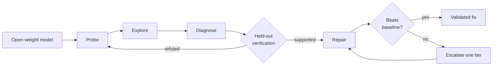
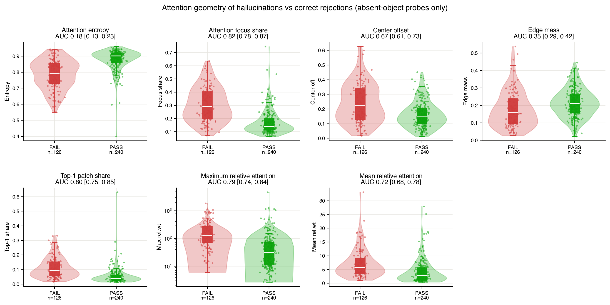

<div align="center">

# EvalRX

### Your eval tells you *what* failed. EvalRX investigates *why*—and tests what fixes it.

[](https://pypi.org/project/evalrx/)
[](https://pypi.org/project/evalrx/)
[](https://github.com/evalvitals/evalrx/actions/workflows/ci.yml)
[](https://evalvitals.github.io/evalrx/overview/)
[](LICENSE)

[Get started](#quickstart-analyze-your-eval-logs) · [Documentation](https://evalvitals.github.io/evalrx/overview/) · [Examples](examples/README.md) · [PyPI](https://pypi.org/project/evalrx/)

</div>

Every eval stack ends at a score. EvalRX starts there and closes the loop:
probe the model for failures, find the structure behind them, propose a
mechanism, **test it on cases the analysis never saw**, then build a repair and
prove it beats the unmodified baseline. When a repair fails, the loop escalates
to a more invasive class of fix and tries again.

The aim is a model that gets measurably better each time round — without a
human guessing at the cause.



### The repair ladder

"Fix it" is not one action. Repairs are ordered by how deeply they cut into the
model — each rung buys causal reach and costs deployability:

| | Intervention space | Status |
|---|---|---|
| **L1** | Prompt and instruction rewrites | ✅ |
| **L2** | Scaffolds around an unchanged model — multi-call, tools, aggregation | ✅ |
| **L3a** | Read internals — attention-guided cropping, contrastive decoding | ✅ |
| **L3b** | Write internals — attention reweighting, activation steering | ✅ |
| **L4** | **Parameter space — build a dataset, fine-tune, re-test** | ✅ LoRA on the LLM only; other recipe shapes recorded, not yet executed |

Escalation is never automatic. The ceiling is yours to set (default L2); when
every candidate at that ceiling fails paired validation, the loop *recommends*
raising it rather than climbing on its own. At L4 the system always writes a
complete fine-tune recipe; it *executes* the one shape v1 supports —
LoRA on the language model, trained on a diagnosis-only pool you pass as
`FixAgent(finetune_pool=...)`, and validated through the same paired McNemar
+ e-value machinery as every other tier — see
[`fix_internals.py`](evalrx/eval_agent/stages/fix_internals.py) and
[`fix_tiers.py`](evalrx/eval_agent/stages/fix_tiers.py).

**L3b and L4 only exist for open weights.** You cannot modify a forward pass or
fine-tune through somebody's API — which is why this is built on open models.

### One typed shape per stage

Every stage validates what it writes against a machine-readable contract
(`evalrx/contract/`) and drops it in `<run>/contract/`. TypeScript for the
whole pipeline is generated from the same Python — `python -m
evalrx.contract.export --out docs/contract` — so a UI decodes a stage
instead of re-deriving its shape from the event log.

Modality lives in that contract as *slots*, never as a model-kind enum: LLM,
VLM, ALM and AVLM are four subsets of `{text, image, audio, video}`, and
analyzer routing follows the slots a **batch** fills rather than the ones a
model declares. An omni model evaluated on an audio benchmark is diagnosed as
an audio run.

### Why the loop is trustworthy

A self-improving system is only as good as its willingness to reject its own
hypotheses. One that cannot will confidently ship repairs for problems it
invented.

We pointed EvalRX at three Qwen3-VL checkpoints and asked what predicts
object hallucination. It found that attention focus share separates
hallucinations from correct rejections at **AUC 0.82** — then, unprompted,
argued that its *second* strongest signal was an artifact of how attention was
extracted, not a real effect. It marked its own best number optimistic, because
the threshold had been chosen on the rows it was scored on.

**Most eval tools would have shipped you that second finding.**



<sub>Generated by the run, not by hand. The contrast is drawn only over
absent-object probes (n=126 FAIL, n=240 PASS) — the whole-sample version would
have looked stronger and meant less.</sub>

Held-out splits are taken *before* exploration, multiplicity is controlled with
e-BH across the candidate family, and every fix is compared against the
unchanged baseline. A run may end **inconclusive** — and frequently should.

### Two runs you can read right now

No install required — these are real runs, committed unmodified.

| Run | What it shows |
|---|---|
| [**Attention & hallucination**](examples/m2_m3/deco_hallu_explore/reference_output/) | 606 real VLM cases across three checkpoints. Finds AUC 0.82, then attacks its own result. 1 of 4 candidate signals survives adjudication. |
| [**The confound catch**](examples/m2_m3/synthetic_yield_explore/reference_output/) | Catalyst looks significant (ANOVA p = 0.080) until the run notices the groups differ by 21° in temperature. **0 of 4 signals confirmed** — the correct answer. |

## Quickstart: Analyze Your Eval Logs

Install EvalRX:

```bash
pip install evalrx
```

Then point it at a file or directory of JSON/JSONL results:

```bash
evalrx explore ./results \
  --backend codex \
  -q "What distinguishes failed cases from successful ones?" \
  --serve-report
```

`codex` can be replaced with `claude_code`, `opencode`, `gemini_cli`,
`kimi_cli`, or `antigravity`. The selected coding-agent CLI must be installed
and authenticated separately.

Open a finished run in the browser:

```bash
evalrx serve evalrx_explore_output
```

`serve` runs the report UI locally as a small server. For a single portable
file — no server, suitable for sharing — export it instead:

```bash
evalrx report evalrx_explore_output --out report.html
```

Both read the same output directory and render the same UI; see the
[CLI reference](https://evalvitals.github.io/evalrx/cli/) for the rest of the
command set (Langfuse export, a runs panel over several experiments, …).

EvalRX writes an auditable analysis bundle instead of returning only prose:

```text
evalrx_explore_output/
├── exploratory_report.json   # observations, candidate signals, hypotheses
├── records.json              # normalized records used by the analysis
├── figures/                  # rendered charts
├── tables/                   # analysis-ready tables
└── analysis.py               # the generated code that was actually run
```

**A real bundled run:** on the synthetic-yield example, Explore identified
temperature as the strongest observed correlate (`r = 0.90`, 95% CI 0.81–0.95),
found pressure flat (`r = -0.14`) without converting that null into evidence of
absence, and caught that the apparent catalyst effect tracks a 21-unit
temperature imbalance between groups. Zero of four candidate signals cleared
adjudication. [Read the committed bundle →](examples/m2_m3/synthetic_yield_explore/reference_output/)

Already have your own analysis code? Use the analyzer toolkit directly, or
feed the resulting cases into the full diagnosis loop. EvalRX does not
require you to replace your existing eval or observability stack.

## What Makes It Different

| Typical eval workflow | EvalRX |
|---|---|
| Aggregate a metric | Investigate the cases behind the metric |
| Browse failures manually | Search for recurring, structured failure modes |
| Accept an LLM explanation | Turn explanations into falsifiable hypotheses |
| Test on the same cases used for discovery | Separate exploration from held-out confirmation |
| Report a promising prompt rewrite | Compare interventions with the unchanged baseline |
| Choose either API-level or internal analysis | Negotiate black-box and white-box capabilities through one interface |

Statistical gates use paired tests and e-values, including multiplicity control
when several hypotheses or fixes are tried. A run may end **inconclusive**;
EvalRX does not turn weak evidence into a success verdict.

## Three Ways to Use EvalRX

### 1. Explore — raw results to testable hypotheses

`evalrx explore` recursively samples arbitrary JSON/JSONL shapes. The
coding agent performs exploratory data analysis; the host records generated
code, adjudicates host-checkable statistics, renders figures, and proposes
1–3 falsifiable hypotheses.

[Explore guide →](docs/m2_analysis.md)

### 2. Investigate — failures to verified interventions

`VLDiagnoseLoop` chains the full workflow:

```text
M1 targeted probes
 → M2 exploratory and statistical analysis
 → M3 diagnosis hypotheses
 → M4 held-out hypothesis verification
 → M5 surgery and tiered fixes
```

Interventions can range from prompt changes and scaffolds to read/write access
to model internals. Each candidate is evaluated against the unmodified
baseline; automatic escalation happens only when explicitly enabled.

[Full-loop quickstart →](docs/quickstart.md#vldiagnoseloop--automated-failure-attribution-current) ·
[Intervention guide →](docs/intervention.md)

### 3. Analyze — one model, one question

Every registered analyzer follows the same call shape:

```python
from evalrx import Capability, compose
from evalrx.analyzers.attention.summary import AttentionAnalyzer

model = compose(
    "qwen2.5-7b-instruct",
    "hf_local",
    want={Capability.ATTENTION},
)

result = AttentionAnalyzer(layer=-1, top_k=5).run(
    model, "The Eiffel Tower is in"
)

print(result.summary())
```

The analyzer zoo includes attention, uncertainty, hallucination, attribution,
logit-lens, representation-geometry, and agent-trajectory analysis.

[Browse the Analyzer Zoo →](docs/analyzers.md)

## Installation

The core install stays lightweight—no Torch required:

```bash
pip install evalrx
```

Add only the capabilities you need:

```bash
pip install "evalrx[api]"        # OpenAI-compatible API models
pip install "evalrx[local]"      # local Hugging Face models + Torch
pip install "evalrx[interp]"     # interpretability toolchains
pip install "evalrx[viz]"        # plots
pip install "evalrx[stats]"      # inferential statistics
```

For development:

```bash
git clone https://github.com/evalvitals/evalrx.git
cd evalrx
pip install -e ".[dev]"
pytest -m "not gpu"
```

## Architecture in One Minute

Model identity is separate from runtime, and analyzers declare the
capabilities they need. The same model spec can run through a black-box API or
a white-box local backend; only the available capability set changes.

| Contract | Role |
|---|---|
| `ModelSpec` | Model identity: family, repository, architecture traits, modalities. |
| `Backend` | Runtime: local internals, black-box API, or offline batch engine. |
| `Model` | Runnable model with generation and optional internal capture. |
| `Analyzer` | `Analyzer(**params).run(model, data) -> Result`. |
| `Capability` | Matches analyzers to compatible model runtimes before execution. |
| `FailureCase` | Prompts, labels, provenance, metadata, and agent trajectories. |
| `Result` | Human-readable summary plus structured, serializable findings. |

[Read the architecture guide →](docs/architecture.md)

## Reproducible Examples

Two examples ship with **committed output bundles** — readable without
installing anything, marked 📦 below.

| Example | What it demonstrates |
|---|---|
| 📦 [`synthetic_yield_explore`](examples/m2_m3/synthetic_yield_explore/reference_output/) | Standalone Explore on structured tabular outcomes — and a confound caught unprompted. |
| 📦 [`deco_hallu_explore`](examples/m2_m3/deco_hallu_explore/reference_output/) | Explore → held-out hypothesis tests → tiered repair, on 606 real VLM cases. |
| [`deco_hallu`](examples/m1_m5/deco_hallu/) | Decoupled multimodal hallucination diagnosis and intervention. |
| [`qwen_attention`](examples/analyzer_demos/qwen_attention/) | White-box attention analysis on a local model. |

[See all examples →](examples/README.md)

## Documentation

- [Quickstart](docs/quickstart.md)
- [Exploratory Analysis](docs/m2_analysis.md)
- [Intervention & Verification](docs/intervention.md)
- [Analyzer Zoo](docs/analyzers.md)
- [Architecture](docs/architecture.md)
- [Extending EvalRX](docs/extending.md)
- [Roadmap](docs/roadmap.md)

## Project Status

EvalRX is an early-stage research toolkit. Interfaces may evolve, and some
full-loop examples require model weights, a GPU, or an external coding-agent
CLI. Bug reports, reproducible failure cases, analyzer contributions, and
evaluation integrations are welcome.

If EvalRX helps you understand a model failure, consider starring the repo
and sharing the smallest reproducible case—it makes the toolkit better for the
next investigation.
