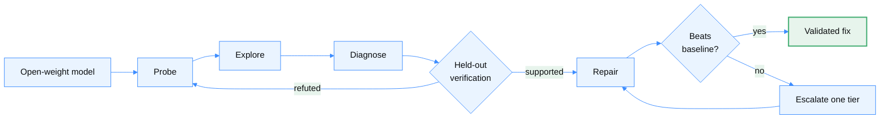
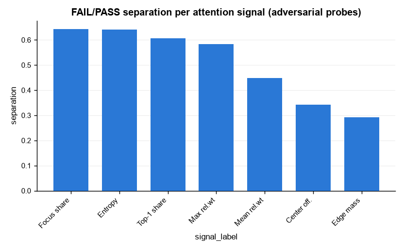

<div align="center">

# EvalRX

### A self-improving loop that repairs open-weight models — and verifies every fix.

<picture>
  <source media="(prefers-color-scheme: dark)" srcset="docs/assets/figures/model-health-teaser-dark.svg">
  
</picture>

[](https://pypi.org/project/evalrx/)
[](https://pypi.org/project/evalrx/)
[](https://github.com/evalvitals/evalrx/actions/workflows/ci.yml)
[](https://evalvitals.github.io/evalrx/overview/)
[](https://evalvitals.github.io/evalrx/demo/)
[](LICENSE)

[Loop](#the-loop) · [Ladder](#the-repair-ladder) · [Trust](#why-the-loop-is-trustworthy) · [Quickstart](#quickstart-analyze-your-eval-logs) · [Docs](https://evalvitals.github.io/evalrx/overview/) · [Demo](https://evalvitals.github.io/evalrx/demo/) · [GitHub](https://github.com/evalvitals/evalrx)

</div>

An eval score is a temperature reading. EvalRX runs the lab: probe a model for
failures, form a mechanism, test it on cases the analysis never saw, then
climb a repair ladder until a fix beats the unmodified baseline. Only a
held-out win updates the model — the healthier model becomes the next subject.

<div align="center">

| 46 | 56 | 744 | 5 | 2 |
|:---:|:---:|:---:|:---:|:---:|
| analyzers implemented | model specs registered | unit tests over the analyzer suite | repair tiers, L1 → L4 | reproducible runs, committed |

</div>

## The loop

Five stages, no hand-off between them: the same agent writes and runs its own
analysis code, proposes the hypotheses, generates the repair candidates, and
decides which tier a mechanism needs. Two stages can send the loop backwards —
a refuted hypothesis returns to probing, a repair that fails moves to the next
tier within the ceiling you set. You supply the question and the ceiling;
everything between is unattended.



The held-out split is taken *before* Explore runs, so Verify always scores on
rows the analysis never touched.

| Stage | What it does |
|---|---|
| **M1** · Discover & Probe | Label which cases fail, then let the protocol choose what to measure on them — black-box or white-box. |
| **M2 → M3** · Explore → Diagnose | Agent-written EDA proposes candidate signals; each becomes a falsifiable, frozen hypothesis before it's tested. |
| **M4** · Verify | Adjudicate every frozen hypothesis against a statistical gate *and* a protocol-consistency gate, on cases neither has seen. |
| **M5** · Intervene & Repair | Confirm the mechanism is causal, then search, freeze, and paired-verify a repair against the unmodified baseline. |

[Full-loop quickstart →](docs/quickstart.md#vldiagnoseloop--automated-failure-attribution-current) ·
[Intervention guide →](docs/intervention.md)

## The repair ladder

"Fix it" is not one action. Repairs are ordered by how deeply they cut into
the model — each rung buys causal reach and costs deployability. Escalation is
never automatic: the ceiling is yours to set (default L2), and when every
candidate at that ceiling fails paired validation the loop *recommends*
raising it rather than climbing on its own.

| | Intervention space | Status |
|---|---|---|
| **L1** | Prompt and instruction rewrites | ✅ |
| **L2** | Scaffolds around an unchanged model — multi-call, tools, aggregation | ✅ |
| **L3a** | Read internals — attention-guided cropping, contrastive decoding | ✅ |
| **L3b** | Write internals — attention reweighting, activation steering | ✅ |
| **L4** | **Parameter space — build a dataset, fine-tune, re-test** | ✅ LoRA on the LLM only; other recipe shapes recorded, not yet executed |

At L4 the system always writes a complete fine-tune recipe; it *executes* the
one shape v1 supports — LoRA on the language model, trained on a
diagnosis-only pool you pass as `FixAgent(finetune_pool=...)`, validated
through the same paired McNemar + e-value machinery as every other tier — see
[`fix_internals.py`](evalrx/eval_agent/stages/fix_internals.py) and
[`fix_tiers.py`](evalrx/eval_agent/stages/fix_tiers.py).

**L3b and L4 only exist for open weights.** You cannot modify a forward pass
or fine-tune through somebody's API — which is why this is built on open
models.

## Why the loop is trustworthy

A self-improving system is only as good as its willingness to reject its own
hypotheses. An agent can enumerate fifty plausible mechanisms as easily as one
— fluency is cheap, and what matters is which of them hold on your data.

| | How the hypothesis is formed | How it's tested | What the conclusion rests on |
|---|---|---|---|
| Hire an experimentalist | Intuition, a handful of candidates at a time | An ablation designed after seeing the data | One researcher's reading, and the ablation they chose to run |
| Let an agent brainstorm | Dozens of plausible candidates at once | A full fine-tune for each one you can afford | Whichever candidates fit the budget |
| **EvalRX** | Candidates from agent-written EDA | Cross-validated while exploring, decided once on a sealed held-out split | A measured effect on reserved cases, corrected for how many were tried, reproducible from the run log |

We pointed EvalRX at three Qwen3-VL checkpoints and asked what predicts object
hallucination. It found that attention focus share separates hallucinations
from correct rejections at **AUC 0.82** `[0.78, 0.87]` — then flagged,
unprompted, that this verdict is in-sample (the rows that found the signal are
the rows that scored it), that its next-strongest signal is collinear with it
(max VIF 20.7), and that a peaked attention map could just as easily be a
readout of an answer the model already settled on as a cause of it.



<sub>Generated by the run, not by hand. Adversarial probes only (n=126 FAIL,
n=240 PASS) — the whole-sample version would have looked stronger and meant
less.</sub>

Held-out splits are taken *before* exploration, multiplicity is controlled
with e-BH across the candidate family, and every fix is compared against the
unchanged baseline. A run may end **inconclusive** — and frequently should.

**Two runs you can read right now** — no install required, committed unmodified:

| Run | What it shows |
|---|---|
| [**Attention & hallucination**](examples/m2_m3/deco_hallu_explore/reference_output/) | 606 real VLM cases across three checkpoints. Finds AUC 0.82, then attacks its own result. |
| [**The confound catch**](examples/m2_m3/synthetic_yield_explore/reference_output/) | Catalyst looks significant (ANOVA p = 0.080) until the run notices the groups differ by 21° in temperature. **0 of 4 signals confirmed** — the correct answer. |

## Quickstart: Analyze Your Eval Logs

Install EvalRX:

```bash
pip install evalrx
```

Then point it at a file or directory of JSON/JSONL results:

```bash
evalrx explore ./results \
  --backend codex \
  -q "What distinguishes failed cases from successful ones?" \
  --serve-report
```

`codex` can be replaced with `claude_code`, `opencode`, `gemini_cli`,
`kimi_cli`, or `antigravity`. The selected coding-agent CLI must be installed
and authenticated separately.

Open a finished run in the browser, or export a single portable file:

```bash
evalrx serve evalrx_explore_output          # local report server
evalrx report evalrx_explore_output --out report.html   # no server, shareable
```

See the [CLI reference](https://evalvitals.github.io/evalrx/cli/) for the rest
of the command set (Langfuse export, a runs panel over several experiments,
…).

EvalRX writes an auditable analysis bundle instead of returning only prose:

```text
evalrx_explore_output/
├── exploratory_report.json   # observations, candidate signals, hypotheses
├── records.json              # normalized records used by the analysis
├── figures/                  # rendered charts
├── tables/                   # analysis-ready tables
└── analysis.py               # the generated code that was actually run
```

**A real bundled run:** on the synthetic-yield example, Explore identified
temperature as the strongest observed correlate (`r = 0.90`, 95% CI 0.81–0.95),
found pressure flat (`r = -0.14`) without converting that null into evidence of
absence, and caught that the apparent catalyst effect tracks a 21-unit
temperature imbalance between groups. [Read the committed bundle →](examples/m2_m3/synthetic_yield_explore/reference_output/)

Already have your own analysis code? Use the analyzer toolkit directly, or
feed the resulting cases into the full diagnosis loop. EvalRX does not require
you to replace your existing eval or observability stack.

## Three Ways to Use EvalRX

**1. Explore** — `evalrx explore` recursively samples arbitrary JSON/JSONL
shapes. The coding agent performs exploratory data analysis; the host records
generated code, adjudicates host-checkable statistics, renders figures, and
proposes 1–3 falsifiable hypotheses. [Explore guide →](docs/m2_analysis.md)

**2. Investigate** — `VLDiagnoseLoop` chains M1 probes → M2 explore → M3
diagnose → M4 held-out verify → M5 surgery and tiered fixes. Interventions
range from prompt changes to read/write access to model internals; automatic
escalation happens only when explicitly enabled.
[Full-loop quickstart →](docs/quickstart.md#vldiagnoseloop--automated-failure-attribution-current)

**3. Analyze** — every registered analyzer follows the same call shape:

```python
from evalrx import Capability, compose
from evalrx.analyzers.attention.summary import AttentionAnalyzer

model = compose(
    "qwen2.5-7b-instruct",
    "hf_local",
    want={Capability.ATTENTION},
)

result = AttentionAnalyzer(layer=-1, top_k=5).run(
    model, "The Eiffel Tower is in"
)

print(result.summary())
```

The analyzer zoo covers attention, uncertainty, hallucination, attribution,
logit-lens, representation-geometry, and agent-trajectory analysis.
[Browse the Analyzer Zoo →](docs/analyzers.md)

## Installation

The core install stays lightweight — no Torch required:

```bash
pip install evalrx
```

Add only the capabilities you need — the most common:

```bash
pip install "evalrx[api]"        # OpenAI-compatible / API models
pip install "evalrx[local]"      # local Hugging Face models + Torch
pip install "evalrx[finetune]"   # L4 parameter-space repair (LoRA via peft)
pip install "evalrx[viz]"        # plots
pip install "evalrx[stats]"      # inferential statistics
```

The full extras list — `interp`, `data`, `observability` (Langfuse), `ui`,
`cluster`, `gemini`, `contract`, `all`, `dev` — is in
[`pyproject.toml`](pyproject.toml).

For development:

```bash
git clone https://github.com/evalvitals/evalrx.git
cd evalrx
pip install -e ".[dev]"
pytest -m "not gpu"
```

## Architecture in One Minute

Model identity is separate from runtime, and analyzers declare the
capabilities they need. The same model spec can run through a black-box API
or a white-box local backend; only the available capability set changes.

| Contract | Role |
|---|---|
| `ModelSpec` | Model identity: family, repository, architecture traits, modalities. |
| `Backend` | Runtime: local internals, black-box API, or offline batch engine. |
| `Model` | Runnable model with generation and optional internal capture. |
| `Analyzer` | `Analyzer(**params).run(model, data) -> Result`. |
| `Capability` | Matches analyzers to compatible model runtimes before execution. |
| `FailureCase` | Prompts, labels, provenance, metadata, and agent trajectories. |
| `Result` | Human-readable summary plus structured, serializable findings. |

Every stage also validates what it writes against a machine-readable contract
(`evalrx/contract/`) and drops it in `<run>/contract/`; TypeScript for the
whole pipeline is generated from the same Python
(`python -m evalrx.contract.export --out docs/contract`), so a UI decodes a
stage instead of re-deriving its shape from the event log.

[Read the architecture guide →](docs/architecture.md)

## Reproducible Examples

Two examples ship with **committed output bundles** — readable without
installing anything, marked 📦 below.

| Example | What it demonstrates |
|---|---|
| 📦 [`synthetic_yield_explore`](examples/m2_m3/synthetic_yield_explore/reference_output/) | Standalone Explore on structured tabular outcomes — and a confound caught unprompted. |
| 📦 [`deco_hallu_explore`](examples/m2_m3/deco_hallu_explore/reference_output/) | Explore → held-out hypothesis tests → tiered repair, on 606 real VLM cases. |
| [`deco_hallu`](examples/m1_m5/deco_hallu/) | Decoupled multimodal hallucination diagnosis and intervention. |
| [`qwen_attention`](examples/analyzer_demos/qwen_attention/) | White-box attention analysis on a local model. |

[See all examples →](examples/README.md)

## Documentation

| | |
|---|---|
| [Quickstart](docs/quickstart.md) | Runnable examples and common entry points |
| [Command-Line Interface](docs/cli.md) | Every `evalrx` subcommand — `explore`, `serve`, `report`, and the rest |
| [Exploratory Analysis](docs/m2_analysis.md) | Standalone `evalrx explore` — descriptive analysis + hypothesis proposal |
| [Intervention & Verification](docs/intervention.md) | Held-out hypothesis tests and the tiered repair ladder |
| [Analyzer Zoo](docs/analyzers.md) | Reference tables of implemented analyzers and registered models |
| [Architecture](docs/architecture.md) | Package structure and design contracts |
| [Extending EvalRX](docs/extending.md) | How to add analyzers, specs, and backends |
| [Roadmap](docs/roadmap.md) | Current implementation status and planned surfaces |

The full site — same pages, searchable — is live at
[evalvitals.github.io/evalrx](https://evalvitals.github.io/evalrx/overview/).

## Project Status

EvalRX is an early-stage research toolkit. Interfaces may evolve, and some
full-loop examples require model weights, a GPU, or an external coding-agent
CLI. Bug reports, reproducible failure cases, analyzer contributions, and
evaluation integrations are welcome.

If EvalRX helps you understand a model failure, consider starring the repo
and sharing the smallest reproducible case — it makes the toolkit better for
the next investigation.
